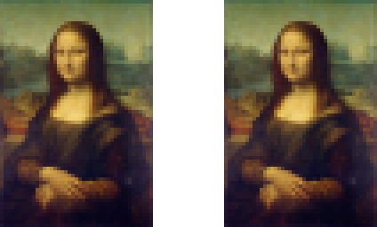

# PODAST
Pointer Data Steganography: new approach to hide data in media
PODAST is being developed as an educational project by [Daan Velthuis](https://github.com/dvelthuis) and [Nout Kleef](https://github.com/nout-kleef).

Steganography is a way of keeping a message from being intercepted by a third party.
This is often achieved by converting the message into binary, and dividing the binary message into smaller pieces,
which are inserted into the binary values of pixels in an image.
The goal is to make as few alterations as possible, as too many changes to the image will result in a noticeable difference.

PODAST tries to make these changes even less obvious, by choosing pixels in such a way that there is often not even a need to alter the binary value of a pixel.
This is achieved by assigning the least significant bits in a pixel to a "pointer", which indicates the next pixel that is to be used for storing data.
By doing so, we can point to the next pixel, which already stores the correct data without even altering any bits in the process.

## demo
The following image shows the source image (left), and the image containing the hidden data.
Yes, they look very similar. No, they really aren't! (Inspect them using an image editor, if you like.)

# How to install
Installing PODAST is quite easy.
1. install a small http server to be able to serve image files on local environment
  * _depends on node package manager, other http servers are possible too!_
  * OSX/Linux
    * open a terminal/command prompt and type `sudo npm install -g http-server`
  * Windows (you may need to run command prompt as administrator)
    * open a terminal/command prompt and type `npm install -g http-server`
2. clone the repository to use the code, or even make some improvements of your own
  * in the terminal/command prompt type `git clone https://github.com/nout-kleef/PODAST.git`
3. run the http server
  * open a new terminal window (navigate to the repository on your device) and type `http-server`
4. your PODAST clone is all set!
